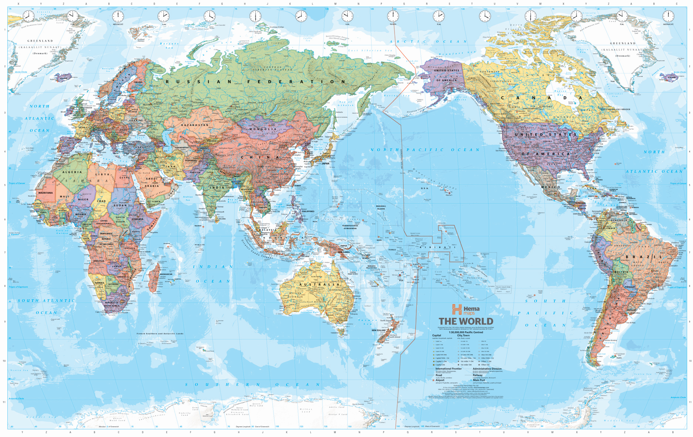

# Word Administrative Division

## Global Administrative Areas (GADM)

The database of [Global Administrative Areas (GADM)](https://gadm.org/) is a spatial database of the world administrative boundaries for use in Geographic Information System (GIS).

Administrative areas in this database are countries and lower level subdivisions such as provinces, departments, regions, cities, communes, districts, wards. GADM describes where these administrative areas are (the "spatial features"), and for each area it provides some attributes, such as the name and variant names.

GADM is one of the highest spatial resolution database available online. As of May 2018, it delimits 386,735 administrative areas.

However GADM has a few drawbacks:

- GADM is not freely available for commercial use;
- The name of administrative areas is poorly localized;
- GADM uses a Microsoft's Access database, which requires some effort to setup on Linux;
- GADM uses multiple character encodings to store localized names of administrative areas;
- Geographic borders of administrative areas level 4 & 5 are not always accurate;
- GADM doesn't support any online editor to allow localizing administrative area names, redefining borders, adding new areas such as cultural areas.

# Software Solution Architecture

# Mission: GADM Data Import Command-Line Interface

# Mission: Online Editor

# Mission: Data Archives Generator
